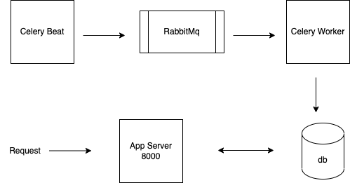

# Fampay
## Custom Youtube

This repository contains the solution in response to the assignment given by Fampay. The service exposes the endpoints as follows:

- Fetch/Search videos: [GET] /api/v1/youtube/videos
 This endpoint searches for the videos in the DB and returns them. 
    ```sh
    Query Params: 
        q (optional): string
        sync_token (optional): int
    Response:
        {'videos': list, 'sync_token': int}
    ```
    q represents search query which is optional and search the stored videos on basis of title and description.
    sync_token which is returned from the response can be passed in the next api call to get the next set of videos from the database. If the sync_token is not passed, it will always return the latest videos.
    Note: Both the API mentioned in the problem statement are combined into one endpoint. If q which is search query is passed, it serves as the SEARCH API, otherwise it serves as GET API.

    
## High Level Design
The high-level architecture have 5 components which can be scaled independently.

- Celery Beat: This is used to schedule the tasks for fetching videos from youtube every 10 secs.
- Celery Worker: The worker picks up the tasks, exceutes them and saves the youtube data in database.
- RabbitMq: This is the message broker used to store the tasks which need to be executed.
- Database: For simplicity, default database supported by Django is used i.e. sqlite3.
- App Server: The server is running on port 8000 and exposes the endpoints to get the videos and search the videos.


    
## Software Requirement
You will need Docker and Docker Compose on the host in order to start the application.


## How to use
Clone the repository:
```sh
git clone https://github.com/SanjanaKansal/fampay_assignment
```
Start the containers:
```sh
DJANGO_SECRET_KEY=<django_secret_key>, YOUTUBE_API_KEY=<youtube_api_key> docker-compose up -d --remove-orphans
```
This will start the complete application and expose a service on port 8000 of the host. A postman collection is attached to give an example of all the APIs in Fampay.postman_collection.json file.


## Tech

- [Python] - Python is a high-level, general-purpose programming language
- [Django] - Django is a Python-based free and open-source web framework
- [celery] - Celery is a distributed task queue written in python
- [RabbitMQ] - RabbitMQ is the most widely deployed open source message broker
- [Docker] - Docker is a set of platform as a service products that use OS-level virtualization to deliver software in packages called containers
- [Docker Compose] - Compose is a tool for defining and running multi-container Docker applications
